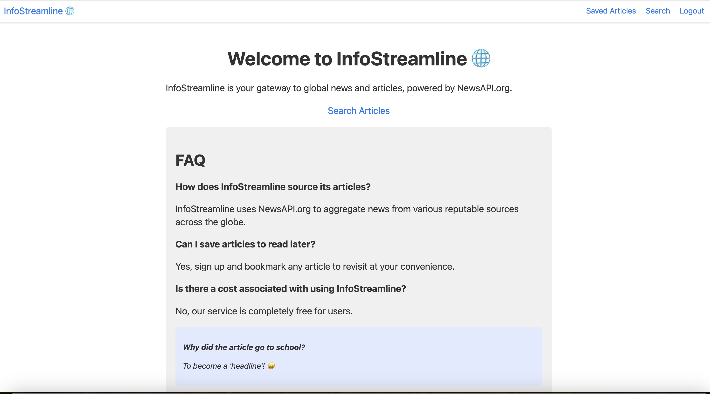

# InfoStreamline: Your Research Companion

## Purpose and Inspiration

InfoStreamline is a research-oriented web application tailored for academics, journalists, and individuals with a keen interest in staying informed about global events. This tool leverages the robust capabilities of NewsAPI to provide users with an extensive, searchable database of news articles. Whether it's for academic research, journalistic endeavors, or personal interest, InfoStreamline aims to streamline the process of finding and organizing relevant news articles.

## Demo

[](./infostreamline.webm)

## Technology Stack

**Frontend:**
- React.js: For building a dynamic and responsive user interface.
- Next.js: For server-side rendering, improved SEO, and efficient routing.
- CSS Modules: For modular and maintainable styling.

**Backend:**
- Node.js and Express: For handling backend logic and API integration.
- MongoDB: For storing user data and saved articles.
- iron-session: For secure user session management in Next.js.

**Third-Party API:**
- NewsAPI: Utilized for fetching a wide range of news articles from various sources.

## Features

- **Comprehensive Article Search**: Utilizes NewsAPI to search for articles based on keywords, facilitating extensive research.
- **Bookmark Articles**: Allows logged-in users to save articles, aiding in research organization and accessibility.
- **Personalized Article Management**: Users can easily access and manage their collection of saved articles.

## Getting Started

### Prerequisites

- Node.js
- npm or yarn
- MongoDB

### Installation

Clone the repository and install dependencies:

```bash
git clone https://github.com/YOUR_GITHUB/YOUR_PROJECT
cd YOUR_PROJECT
npm install
```

### Setting Up Environment Variables
```bash
NEXT_PUBLIC_NEWS_API_KEY=your_newsapi_org_api_key
MONGODB_URI=your_mongodb_connection_uri
IRON_PASS=your_iron_pass_password
```

### Running the Application
```bash
npm run dev
```
### Contributing
Contributions are welcome and greatly appreciated.

- Fork the Project
- Create your Feature Branch (git checkout -b feature/AmazingFeature)
- Commit your Changes (git commit -m 'Add some AmazingFeature')
- Push to the Branch (git push origin feature/AmazingFeature)
- Open a Pull Request

### Next Steps

Leveraging the full potential of the NewsAPI "Everything" endpoint, future enhancements of InfoStreamline can include:

- Advanced Search Filters: Implement additional search filters like language, date range, and source, providing more tailored research capabilities.
- Sorting Options: Introduce sorting functionality based on publication date, relevance, or popularity.
- Analytics Features: Develop analytical tools to identify trends, sentiment, and patterns in news coverage.

### License
InfoStreamline is open source software [licensed as MIT](https://opensource.org/license/mit/).